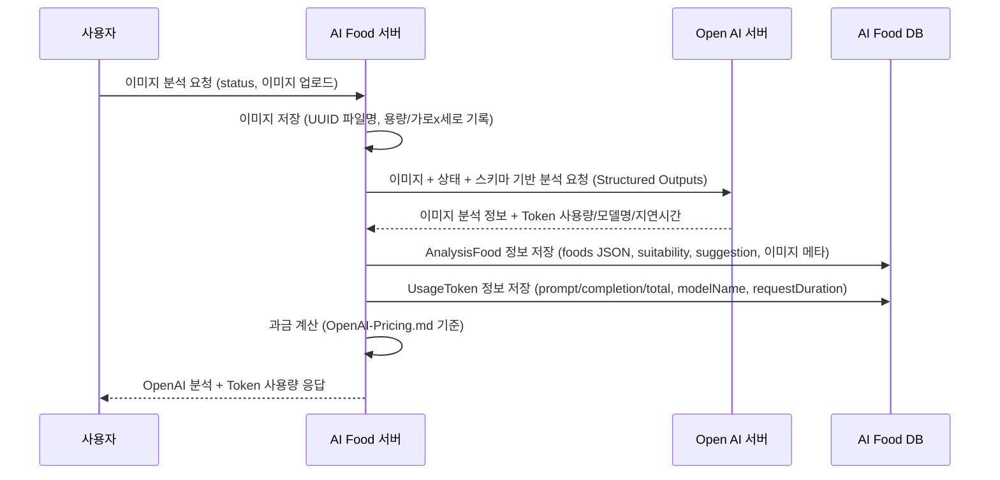

# 음식 이미지 분석 개인 맞춤 서비스

# API

## 챗

- /v1/chat/completions
- post
- RequestBody:

  "content": string 요청 프롬프트

- Open API 호출 /v1/chat/completions
- LLM으로 부터 응답이 완료된 후에 AIP의 응답을 한다.

## 모델 정보

- /v1/models
- get

- Open API http://localhost:1234/v1/models 를 호출하여 응답 받은 정보를 응답

## 음식 이미지 분석 요청

- /v1/food/analysis
- 음식 이미지 업로드
- RequestBody:
  "status": string 사용자의 상태 `,`구분자로 상태표현 예) 남성,64세,체중78kg,키167cm,공복혈당120

<Open AI 요청>

- `RestClient`보다 Spring AI 라이브러리에서 제공하는 `ChatModel`, `ChatClient`와 같은 객체를 사용하여 요청한다.
- Open API에 음식이미지, RequestBody, 페르소나, 응답 json 스키마를 전달한다.
- 페르소나: 너는 사용자의 생활과 식습관을 살펴보고, 작은 변화로도 건강한 하루를 이어갈 수 있도록 함께 응원하고 도와주는 AI 생활 코치이다.

- Structured model outputs 
Open AI 의 response_format, json_schema 기능을 사용한다. https://json-schema.org/specification

Spring AI 에서 지원하는 Structured model outputs 기능을 사용한다. https://docs.spring.io/spring-ai/reference/api/chat/openai-chat.html#_structured_outputs
`org.springframework.ai.openai.api.ResponseFormat`

스키마는 다음 정보를 포함한다.
    - 식사 이미지를 분석한 음식의 리스트
    - 음식별 탄단지, 칼로리, 이미지에서의 위치(x, y)
    - 사용자의 상태를 고려하여 적합한 식사 이미지를 분석하여 더 좋은 식사를 제안

- Prompt 와 같은 `String` 은 `"""`를 이용하여 선언한다.

[설명]
- 이미지 저장: 업로드된 원본 파일명과 별개로 서버는 충돌 방지를 위해 UUID 기반 물리 파일명을 생성하여 저장한다. 저장 경로는 `app.upload.dir`(기본값 `data/uploads`).
- Structured Outputs: Spring AI의 `ResponseFormat.JSON_SCHEMA`를 사용하여 `schema/food-analysis-schema.json`에 맞춘 JSON만 응답받는다.
- DB 저장:
  - AnalysisFood: 사용자 상태(userStatus), OpenAI 응답의 foods(JSON 문자열), suitability, suggestion, 이미지 메타데이터(imageUserFileName, imageFileName, imageFileSize, imageSize) 저장.
  - UsageToken: 모델명(modelName), 요청-응답 소요시간(requestDuration, ms) 및 토큰 수치(promptTokens, completionTokens, totalTokens). 토큰 수치는 공급자에 따라 미제공일 수 있다.
- 과금: `prompts/OpenAI-Pricing.md`를 참조하여 모델별 단가와 UsageToken을 이용해 비용 계산.

### Entity

- 음식 이미지 분석 요청을 이력 관리한다.

- Domain: Food
- Entity: AnalysisFood
  - id
  - userStatus: 사용자의 상태
  - foods: Open AI 응답의 foods, JSON 구조의 String 그대로 저장
  - suitability: Open AI 응답의 suitability
  - suggestion: Open AI 응답의 suggestion
  - imageUserFileName: 사용자가 업로드한 이미지의 이름
  - imageFileName: 중복 방지 서버에서 관리하는 물리적 이미지 이름, UUID로 생
  - imageFileSize: 단위 bytes
  - imageSize: 가로 세로 사이즈, 단위 픽셀
  - UsageToken

## Open AI Token 사용 이력

- Token 사용량 과금 계산
- 사용한 모델에 따라 과금 계산은 `OpenAI-Pricing.md`를 참조

### Entity

- Open AI에서 사용 토큰양을 이력 관리한다.

- Domain: Usage
- Entity: UsageToken
    - id
    - promptTokens
    - completionTokens
    - totalTokens
    - modelName
    - requestDuration: Open AI 요청 응답 소요시간 단위 ms

## 음식 분석 상세 조회

- DB에 저장된 음식 이미지 분석 내용을 조회한다.

- /v1/food/analysis/{id}
- GET
- PathString
  - id: AnalysisFood의 id
- 응답
 - FoodAnalysisResponse

## 음식 분석 목록 조회

- DB에 저장된 음식 이미지 분석 내용을 모두 조회한다.

- /v1/food/analysis
- GET
- 응답
  - List<FoodAnalysisResponse>

## 음식 이미지 조회

- 'data/uploads'에 있는 이미지를 응답한다.

- /v1/food/analysis/image?fileName={fileName}